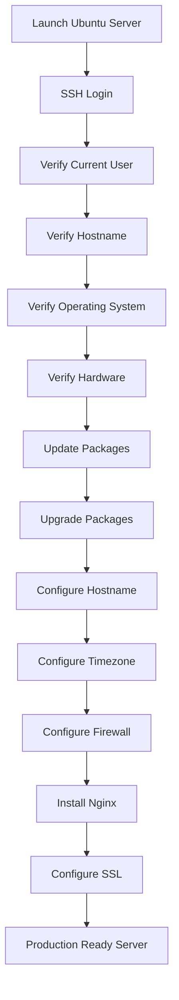

# Production Linux Server Setup Workflow

This diagram illustrates the complete workflow for preparing a production-ready Linux server.

---

## Learning Outcome

After completing this workflow you will be able to:

- Deploy a production Linux server
- Verify server configuration
- Prepare the server for application deployment
- Follow a standardized production workflow
