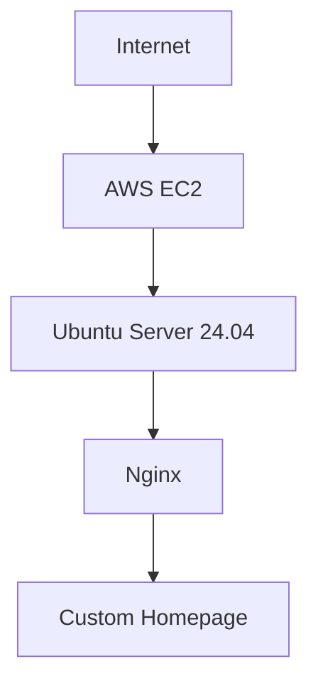

# Architecture

```mermaid
flowchart TD
    A[Internet] --> B[AWS EC2]
    B --> C[Ubuntu Server 24.04]
    C --> D[Nginx]
    D --> E[Custom Homepage]
```

## Description

A request comes from the Internet to the AWS EC2 instance.

The Ubuntu server receives the request, and Nginx serves the custom homepage to the client.
